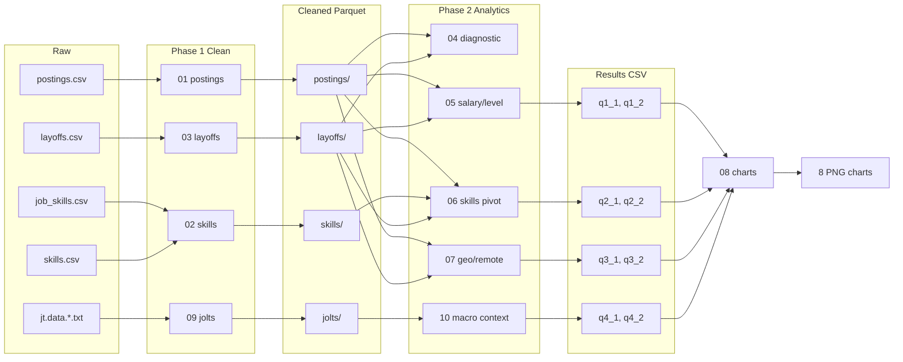

# LinkedIn Job Market Analytics (Spark)

A lean, end-to-end Apache Spark pipeline that profiles, cleans, joins, and analyzes four public datasets to ask: **"Do layoff-affected companies hire differently than the rest of the US job market?"**

Built for NYU CSCI-GA.2437 (Big Data Application Development, Spring 2026). Solo team, professor-approved. Hyper-lean MVP — no unnecessary abstractions, no production polish.

## Status

| Phase | Scope | State |
|---|---|---|
| Phase 1 — Profile + clean | Scripts 01-03 (postings, skills, layoffs) | Complete and submitted Apr 24, 2026 (`submission/Dhairya_dpm8739_phase1/`) |
| Phase 2 — Cohort analytics | Scripts 04-07, six Spark SQL queries | Complete |
| Phase 2 add-on — JOLTS macro context | Scripts 09-10, two macro queries | Complete |
| Phase 2 — Charts | Script 08 (pandas + matplotlib), eight PNGs | Complete |
| Phase 3 — Report + presentation | `submission/final_submission/` | In progress (due May 7 / May 5, 2026) |

End-to-end pipeline last verified reproducible **May 4, 2026** — full Docker rerun completed in ~6 min 41 s, all eight result CSVs, eight chart PNGs, and four Parquet datasets reproduced bit-equivalently against the numbers cited below.

## TL;DR findings

1. Companies in the layoffs dataset that also posted on LinkedIn in 2023-2024 (**n=432 companies, 3,569 postings**) are overwhelmingly big tech: Amazon, Intel, Oracle, Microsoft, Meta, Google, Salesforce, Cisco, Tesla, etc.
2. This cohort pays **~2x higher** at Entry level, posts **~66% Mid-Senior** roles vs 43% for the rest of the market, concentrates **1.78x more** tech-leaning skills, allows remote **1.7x more often**, and clusters in CA + VA + WA + TX + NY tech hubs.
3. BLS JOLTS macro data reframes the "2023 tech layoff wave" narrative: the **aggregate Information-sector layoff rate in 2023-2024 (median 1.1%) was normal** — well below the 2020 COVID peak of 6.6%. The real shift was a **hiring freeze**: job openings fell 48% from their 2022 peak (8.3% -> 4.3%), and hires dropped to 2.5%. The "wave" was visible big-name cuts, not sector-wide elevation.

8 deliverable charts (`output/charts/`) tell the complete story.

## Project structure

```
job-posting-analytics-spark/
├── data/
│   ├── linkedin/                    # LinkedIn job postings + skills (Kaggle)
│   │   ├── postings.csv             # ~123k postings, 2023-2024
│   │   ├── jobs/job_skills.csv      # job_id -> skill_abr mapping
│   │   └── mappings/skills.csv      # skill_abr -> skill_name lookup
│   ├── layoffs/
│   │   └── layoffs.csv              # Tech layoffs 2020-2026 (Kaggle, ~4.3k rows)
│   └── jolts/                       # BLS JOLTS time series (public domain)
│       ├── jt.data.2.JobOpenings
│       ├── jt.data.3.Hires
│       ├── jt.data.6.LayoffsDischarges
│       └── jt.industry
├── scripts/
│   ├── 01_profile_and_clean_postings.py          # Phase 1
│   ├── 02_profile_and_clean_skills.py            # Phase 1
│   ├── 03_profile_and_clean_layoffs.py           # Phase 1
│   ├── 04_diagnostic_join_check.py               # Phase 2 Step 0
│   ├── 05_analytics_salary_level.py              # Phase 2 Angle 1
│   ├── 06_analytics_skills_pivot.py              # Phase 2 Angle 2
│   ├── 07_analytics_geo_remote.py                # Phase 2 Angle 3
│   ├── 08_make_charts.py                         # Pandas + matplotlib
│   ├── 09_profile_and_clean_jolts.py             # Phase 2 Add-on
│   └── 10_analytics_macro_context.py             # Phase 2 Add-on
├── output/
│   ├── parquet/         # Cleaned datasets (Snappy Parquet)
│   ├── profiles/        # Long-form profile CSVs (dataset, column, metric, value)
│   ├── diagnostics/     # Step 0 join hit-rate summary
│   ├── results/         # One CSV per analytics query (q1_1 through q4_2)
│   ├── charts/          # 8 PNGs (the report deliverables)
│   └── logs/            # One log per script, labeled and grep-friendly
├── IMPLEMENTATION_PLAN.md           # Phase 1 + Phase 2 + Add-on spec
├── PHASE_2_IMPLEMENTATION_PLAN.md   # Phase 2 analytics detail (locked)
└── Readme.md                        # This file
```

## Datasets

| # | Source | License | Coverage | Role |
|---|---|---|---|---|
| 1 | Kaggle `arshkon/linkedin-job-postings` | See Kaggle terms | 2023-2024, ~123k US postings | Primary postings data |
| 2 | Kaggle `swaptr/layoffs-2022` | See Kaggle terms | 2020-03 to 2026-04, ~4.3k events | Defines the "layoff-affected" cohort |
| 3 | [BLS JOLTS](https://www.bls.gov/jlt/) | Public domain (US government) | 2000-12 to 2026-02, monthly | Macro hiring context |

## Architecture

Everything in Spark per course requirement. One pandas+matplotlib script at the end for chart rendering only. No orchestration layer; scripts run linearly via `spark-submit`.



## How to run

### Prerequisites

1. **Docker Desktop** running, with at least 8 GB RAM allocated to the Linux engine. No host-side Python or Spark install is required — everything runs inside the `jupyter/pyspark-notebook` image.
2. **Datasets** populated under `data/` as described in [Downloading the data](#downloading-the-data) below. None are committed to git.

### Downloading the data

None of the raw inputs are committed to git. After cloning, populate `data/` so it matches the layout in the project tree above.

The pipeline reads exactly **7 files** across **3 sources**:

```
data/
├── linkedin/
│   ├── postings.csv                          ~493 MB   Kaggle (account required)
│   ├── jobs/job_skills.csv                   ~3.5 MB   Kaggle (account required)
│   └── mappings/skills.csv                   <1 KB     Kaggle (account required)
├── layoffs/
│   └── layoffs.csv                           ~744 KB   Kaggle (account required)
└── jolts/
    ├── jt.data.2.JobOpenings                 ~6 MB     BLS (public domain)
    ├── jt.data.3.Hires                       ~6 MB     BLS (public domain)
    └── jt.data.6.LayoffsDischarges           ~6 MB     BLS (public domain)
```

#### 1. JOLTS (BLS, no account needed)

Public-domain US government data. BLS rejects unidentified clients, so requests must carry a `User-Agent` header that includes a real contact email.

PowerShell:

```powershell
mkdir -Force data/jolts | Out-Null
$ua = "job-posting-analytics-spark (your-email@example.com)"
foreach ($f in @("jt.data.2.JobOpenings","jt.data.3.Hires","jt.data.6.LayoffsDischarges")) {
  Invoke-WebRequest -Uri "https://download.bls.gov/pub/time.series/jt/$f" `
    -OutFile "data/jolts/$f" `
    -UserAgent $ua
}
```

bash / zsh:

```bash
mkdir -p data/jolts
UA="job-posting-analytics-spark (your-email@example.com)"
for f in jt.data.2.JobOpenings jt.data.3.Hires jt.data.6.LayoffsDischarges; do
  curl -A "$UA" -o "data/jolts/$f" "https://download.bls.gov/pub/time.series/jt/$f"
done
```

Replace `your-email@example.com` with a real address.

#### 2. LinkedIn job postings (Kaggle)

Source: [`arshkon/linkedin-job-postings`](https://www.kaggle.com/datasets/arshkon/linkedin-job-postings) (~520 MB zipped).

**Option A - Kaggle CLI (recommended).**

1. `pip install kaggle`
2. Sign in at [kaggle.com](https://www.kaggle.com) -> *Account -> Settings -> API -> Create New Token*. Save `kaggle.json` to `~/.kaggle/kaggle.json` (Linux/macOS) or `C:\Users\<you>\.kaggle\kaggle.json` (Windows).
3. From the project root:

```bash
kaggle datasets download -d arshkon/linkedin-job-postings -p data/linkedin --unzip
```

The Kaggle bundle expands a wider tree than this project uses. Only `postings.csv`, `jobs/job_skills.csv`, and `mappings/skills.csv` are read by the pipeline; the rest can stay or be deleted.

**Option B - Browser.** Download the zip from the dataset page, extract, and place the three files at:

- `data/linkedin/postings.csv`
- `data/linkedin/jobs/job_skills.csv`
- `data/linkedin/mappings/skills.csv`

#### 3. Layoffs (Kaggle)

Source: [`swaptr/layoffs-2022`](https://www.kaggle.com/datasets/swaptr/layoffs-2022) (~750 KB).

**Option A - Kaggle CLI.**

```bash
kaggle datasets download -d swaptr/layoffs-2022 -p data/layoffs --unzip
```

**Option B - Browser.** Download, extract, and place `layoffs.csv` at `data/layoffs/layoffs.csv`.

#### Verifying the layout

A quick sanity check before kicking off the pipeline.

PowerShell:

```powershell
@(
  "data/linkedin/postings.csv",
  "data/linkedin/jobs/job_skills.csv",
  "data/linkedin/mappings/skills.csv",
  "data/layoffs/layoffs.csv",
  "data/jolts/jt.data.2.JobOpenings",
  "data/jolts/jt.data.3.Hires",
  "data/jolts/jt.data.6.LayoffsDischarges"
) | ForEach-Object { "{0,-50} {1}" -f $_, $(if (Test-Path $_) { "OK" } else { "MISSING" }) }
```

bash:

```bash
for f in \
  data/linkedin/postings.csv \
  data/linkedin/jobs/job_skills.csv \
  data/linkedin/mappings/skills.csv \
  data/layoffs/layoffs.csv \
  data/jolts/jt.data.2.JobOpenings \
  data/jolts/jt.data.3.Hires \
  data/jolts/jt.data.6.LayoffsDischarges; do
  [ -f "$f" ] && echo "OK       $f" || echo "MISSING  $f"
done
```

All seven should report `OK` before running `01_profile_and_clean_postings.py`.

### One-shot pipeline (PowerShell)

From the project root:

```powershell
docker run --rm -v "${PWD}:/home/jovyan/work" --memory=8g jupyter/pyspark-notebook bash -lc '
  set -e; cd /home/jovyan/work &&
  spark-submit scripts/01_profile_and_clean_postings.py 2>&1 | tee output/logs/01_postings.log &&
  spark-submit scripts/02_profile_and_clean_skills.py   2>&1 | tee output/logs/02_skills.log &&
  spark-submit scripts/03_profile_and_clean_layoffs.py  2>&1 | tee output/logs/03_layoffs.log &&
  spark-submit scripts/04_diagnostic_join_check.py      2>&1 | tee output/logs/04_diagnostic.log &&
  spark-submit scripts/05_analytics_salary_level.py     2>&1 | tee output/logs/05_salary_level.log &&
  spark-submit scripts/06_analytics_skills_pivot.py     2>&1 | tee output/logs/06_skills_pivot.log &&
  spark-submit scripts/07_analytics_geo_remote.py       2>&1 | tee output/logs/07_geo_remote.log &&
  spark-submit scripts/09_profile_and_clean_jolts.py    2>&1 | tee output/logs/09_jolts.log &&
  spark-submit scripts/10_analytics_macro_context.py    2>&1 | tee output/logs/10_macro_context.log &&
  python       scripts/08_make_charts.py                2>&1 | tee output/logs/08_charts.log
'
```

Total runtime: ~5-7 minutes on a laptop with 8 GB RAM allocated to Docker. The same command works from `bash` / `zsh` on Linux/macOS by replacing `${PWD}` with `$(pwd)`.

### Verifying a successful run

Each script writes a grep-friendly `DONE:` marker as its last informative line. After the one-shot completes, every log under `output/logs/` should end with one. Quickest sanity check:

```powershell
# PowerShell
Get-ChildItem output/logs/*.log | ForEach-Object {
  $d = Select-String -Path $_.FullName -Pattern '^DONE:' | Select-Object -Last 1
  "{0,-22} {1}" -f $_.Name, $(if ($d) { $d.Line } else { '<no DONE>' })
}
```

You should see ten `DONE: ...` lines and the following artifacts on disk: four `output/parquet/<name>/_SUCCESS` markers, eight `output/results/q*/part-*.csv` files, and eight `output/charts/q*.png` images.

### Iterating on a single step

The pipeline is deterministic and idempotent — every Parquet/CSV/PNG writer uses `mode("overwrite")` — so any individual step can be re-run on its own once its upstream Parquet exists, e.g.

```powershell
docker run --rm -v "${PWD}:/home/jovyan/work" -w /home/jovyan/work --memory=8g `
  jupyter/pyspark-notebook spark-submit scripts/06_analytics_skills_pivot.py
```

(`-w /home/jovyan/work` makes the relative `scripts/...` and `output/...` paths inside each script resolve correctly. PowerShell uses backtick `` ` `` for line continuation; `bash`/`zsh` users can substitute backslash `\`.)

## The phases

### Phase 1 - Profile and clean (4 datasets)

Each data source gets its own `NN_profile_and_clean_<name>.py` script following a single shared pattern:

1. Load the raw CSV (LinkedIn multi-line CSV options, tab-separated for BLS).
2. Profile: schema, row count, per-column null counts, distinct counts on key categoricals, top-10 value counts, `describe()` for numerics, 5-row sample.
3. Apply the cleaning rules documented in `IMPLEMENTATION_PLAN.md` (salary sanity bounds, date parsing, `company_normalized` for join, etc.).
4. Write a long-form profile CSV (`dataset, column, metric, value`) to `output/profiles/<name>/`.
5. Write the cleaned dataset to `output/parquet/<name>/` with `mode("overwrite")`.

All logs use grep-friendly `PROFILE:`, `CLEAN:`, `DONE:` prefixes so `grep PROFILE: output/logs/*.log` reads as evidence.

### Phase 2 Step 0 - Join viability diagnostic

Before any analytics, **Script 04** checks whether the `postings <-> layoffs` join on `company_normalized` actually produces a usable sample. It does. 432 of 2,505 layoff companies matched (17.25%), but those 432 cover the headcount-heavy big names (Amazon, Intel, Oracle, Microsoft, Meta, Google, Salesforce, Cisco, Tesla, IBM...), so the matched cohort is both defensible and analytically rich despite the modest company-count hit rate.

### Phase 2 - Cohort analytics (6 Spark SQL queries)

Every posting gets tagged `layoff_affected` if its `company_normalized` appears in the cleaned layoffs dataset, else `non_affected`. Six queries in three scripts compare the two cohorts across the three thesis angles:

| Query | Script | Question |
|---|---|---|
| Q1.1 | `05` | Median USD salary by experience level, per cohort? |
| Q1.2 | `05` | Share of postings by experience level, per cohort? |
| Q2.1 | `06` | Top 10 skills by share of skill tags, per cohort? |
| Q2.2 | `06` | Share of tech-leaning skills (ENG, IT, ANLS, PRDM), per cohort? |
| Q3.1 | `07` | Remote-allowed rate, per cohort? |
| Q3.2 | `07` | Top 10 states by share of postings, per cohort? |

All written in Spark SQL (not DataFrame API) for readability in the report.

### Phase 2 Add-on - Macro context (BLS JOLTS)

Scripts 09 + 10 add a fourth data source: 25 years of monthly BLS JOLTS data (2000-present) for two industries (Total Nonfarm, Information) and three metrics (Job Openings, Hires, Layoffs & Discharges — all seasonally adjusted rates). Two additional queries and two line-chart PNGs frame the 2023-2024 cohort snapshot inside the macro cycle.

### Script 08 - Charts (pandas + matplotlib, no Spark)

Reads the 8 result CSVs from `output/results/` and renders 8 self-contained PNGs to `output/charts/`. Every chart has: title, subtitle, cohort-definition footer, bold takeaway line, sample sizes, consistent color scheme (orange = layoff-affected, blue = other, gray = macro baseline). Chart types vary by query - dumbbell for Q1.1, 100% stacked bar for Q1.2, shared-x horizontal bars for Q2.1/Q3.2, donut pies for Q2.2, metric callout cards for Q3.1, line charts for Q4.1/Q4.2.

## Findings (detailed)

### The matched cohort is "big tech that got headlines"

Out of ~2,500 distinct companies in `layoffs.csv`, only 432 also appear as employers in the 2023-2024 LinkedIn postings. But those 432 are the names everyone recognizes:

```
Amazon    58,124 laid off over 2020-2026   343 postings 2023-2024
Intel     43,115                            20
Oracle    31,294                            93
Microsoft 30,055                            62
Meta      27,700                            73
Salesforce 16,525                           40
Cisco     14,521                            36
Tesla     14,500                            51
Google    13,697                            88
IBM        4,900                            33
```

So "layoff-affected" in this project really means "big US tech employer that had visible cuts AND keeps hiring." Every downstream comparison should be read with that framing.

### Angle 1 - Salary and level (Q1.1, Q1.2)

- At every experience level, the layoff-affected cohort pays a higher median. The gap is most extreme at Entry level ($101,750 vs $52,000, ~2x).
- The layoff cohort's posting distribution is massively senior-heavy: 66.4% Mid-Senior, only 19.0% Entry level. The broader market is 39.6% Entry level, 43.2% Mid-Senior.
- Conclusion: big tech pays above market for seniors AND prefers to hire them. This is a pre-existing FAANG pattern, not a post-layoffs shift.

### Angle 2 - Skills pivot (Q2.1, Q2.2)

- Layoff cohort top skills: Information Technology 19.4%, Engineering 13.1%, Sales 10.6%, Management 5.9%, Business Development 5.7%.
- Other market top skills: IT 12.1%, Sales 10.3%, Management 10.1%, Manufacturing 8.7%, Healthcare Provider 8.3%.
- Consolidated tech-leaning (ENG + IT + ANLS + PRDM): **36.4% for layoff cohort, 20.4% for other** (1.78x ratio).
- Conclusion: layoff cohort is structurally more technical. Manufacturing and Healthcare - large chunks of the broader market - are essentially absent from big-tech hiring mix.

### Angle 3 - Geographic and remote (Q3.1, Q3.2)

- Remote-allowed rate: layoff cohort 20.15%, other cohort 11.87% (+8.28 percentage points, 1.70x).
- Top 5 states: layoff cohort CA + VA + WA + TX + NY accounts for 58.4% of its postings. The same top-5 for the other cohort covers only 34.7% (CA + TX + FL + NY + NC).
- Conclusion: layoff cohort concentrates in tech hubs and allows more remote. Both are well-established big-tech patterns.

### Macro context - JOLTS (Q4.1, Q4.2)

This is the single most reframing piece of the whole project.

- **Q4.1:** Information-sector layoff rate in 2023-2024 had a median of 1.1%, well below the 2020 COVID peak of 6.6% and roughly matching the 25-year median. The aggregate data simply does not show a "2023 tech layoff wave." The big-name cuts (Amazon 58k, Intel 43k, Meta 27k, etc.) show up as events in `layoffs.csv` but don't dominate the sector rate.
- **Q4.2:** What DID happen in 2023-2024 was a **hiring freeze**. Information-sector job openings peaked at 8.3% in 2022 and fell to 4.3% by 2023-2024 (a 48% drop). Hires fell from 3.5% to 2.5%. Openings exceeded hires throughout - meaning companies posted more roles than they filled, consistent with slow time-to-hire and selective hiring.

### The integrated story

When you stack all 8 charts together:

> **"Big tech companies with publicly visible 2020-2026 layoffs still hired aggressively on LinkedIn during 2023-2024 - but mostly senior, mostly technical, mostly in tech hubs, mostly remote-friendly, and mostly at above-market pay. What looked like a crisis to consumers of tech-industry news was, in aggregate, a hiring slowdown concentrated at the entry-to-mid levels, with specific headline-grabbing cuts masking otherwise normal separation rates."**

That's the thesis answer this dataset can actually defend.

## Data integrity and limitations

**Verified with an independent cross-check script**: all row counts reconcile end-to-end, no duplicate `(job_id, skill_abr)` pairs, no layoffs missing both laid-off fields, JOLTS filtered to exactly 6 series x 303 months = 1,818 rows.

Known limitations worth mentioning in any report:

1. **Hit rate is 17.25% at company level.** The cohort comparison leans on 3,569 postings vs 118,116 - a ~33x imbalance. Cell sizes for stratified cuts (e.g. Q1.1 Executive layoff-affected = 10 postings) are small. Every chart labels its sample size.
2. **1,709 postings (~1.4%) have null `company_normalized`** (originally missing `company_name` in the raw Kaggle feed). They are silently excluded from cohort tagging.
3. **8,690 skill tags reference job_ids that Phase 1 dropped for bad salary.** Q2.1/Q2.2 use INNER JOIN so these are transparently excluded. Not a correctness bug; a minor sample reduction.
4. **Postings is a 2023-2024 snapshot.** The original thesis phrasing ("resumed hiring at the same scale as before") implied before/after. No LinkedIn dataset gives us that, so this project delivers a **cohort-comparison** answer instead. JOLTS provides the longitudinal macro frame the postings data can't.
5. **"Information sector" is not exactly "tech".** BLS NAICS 51 is the closest public-data proxy but excludes a lot of tech (Amazon is retail/e-commerce in BLS taxonomy, Tesla is manufacturing). Read JOLTS findings as "tech-adjacent sector," not "all tech".
6. **Twitter/X alias in postings.** A `company_normalized in ('x', 'x corp') -> 'twitter'` alias is applied at analytics time. It's defensive; verification showed no `x` rows in the current postings slice, so it is a no-op here but would recover Twitter postings in a future snapshot where they appear.

## What is and isn't in scope

**In scope**: profile, clean, join, per-cohort analytics, macro-context time series, static PNG charts.

**Out of scope (deliberately)**: MLlib, Spark Streaming, GraphX/GraphFrames, interactive dashboards, anything commercial (Lightcast, etc.), anything requiring authentication, anything predictive. All by assignment constraint and leanness discipline.

## Documentation map

This repo intentionally keeps planning, code, and reporting docs co-located instead of in a separate wiki. If you are reading the project for the first time, the recommended order is:

| Doc | Purpose | When to read |
|---|---|---|
| `Readme.md` (this file) | Top-level overview, run instructions, headline findings, status | First |
| `IMPLEMENTATION_PLAN.md` | Phase 1 spec (cleaning rules per dataset) + cross-phase checkpoints | When inspecting Phase 1 logic |
| `PHASE_2_IMPLEMENTATION_PLAN.md` | Locked spec for the six core analytics queries (Q1.1-Q3.2) | When inspecting Phase 2 SQL |
| `submission/final_submission/README.md` | Index of the final-report workspace and reading order | Before grading-style review |
| `submission/final_submission/FINAL_REPORT.md` | The 5-8 page report content (markdown source for the May 7 PDF) | For the full narrative |
| `submission/final_submission/PRESENTATION_OUTLINE.md` | 10-slide deck outline for the May 5 in-class symposium | Before building slides |
| `submission/final_submission/appendix/A_thesis_revision_rationale.md` | Why the longitudinal thesis was pivoted to cross-sectional | When questioning the thesis |
| `submission/final_submission/appendix/B_methodological_confounds.md` | Detailed limitations write-up | When questioning a finding |
| `submission/final_submission/appendix/C_decisions_log.md` | 15 major engineering/analytical decisions, merit + demerit each | For Q&A defense |
| `submission/final_submission/appendix/D_findings_inferences_review.md` | Per-chart honesty pass on what each inference can defensibly claim | When sanity-checking a chart |
| `submission/final_submission/appendix/E_action_items.md` | Tier-1/2/3 remaining work for Phase 3 with effort estimates | For sequencing the final push |

The `submission/Dhairya_dpm8739_phase1/` folder is the **frozen** Phase 1 ingestion deliverable submitted on Apr 24, 2026 — kept verbatim, not edited again.

## Commit history and progress checkpoint

See `IMPLEMENTATION_PLAN.md` for the chronological build record — every phase has checkboxes marking completion, and per-phase subsections document the decisions made. `PHASE_2_IMPLEMENTATION_PLAN.md` is the locked spec for the six core analytics queries.

Built over a focused multi-day sprint, with deliberate stop-points to gate further work on evidence (e.g., Step 0 diagnostic before committing to Phase 2 analytics scripts, JOLTS integrity check before trusting its takeaways).

## Verified Repository Notes

Reviewed on 2026-06-30.

Primary executable scripts currently present at the repository root:

| Script | Purpose |
|---|---|
| `scripts/01_profile_and_clean_postings.py` | Profile and clean LinkedIn postings. |
| `scripts/02_profile_and_clean_skills.py` | Profile and clean job skill tags. |
| `scripts/03_profile_and_clean_layoffs.py` | Profile and clean layoffs data. |
| `scripts/04_diagnostic_join_check.py` | Validate join assumptions before analytics. |
| `scripts/05_analytics_salary_level.py` | Salary and experience-level cohort analysis. |
| `scripts/06_analytics_skills_pivot.py` | Skill mix and tech-skill analysis. |
| `scripts/07_analytics_geo_remote.py` | Geographic and remote-work analysis. |
| `scripts/08_make_charts.py` | Generate static chart PNGs. |
| `scripts/09_profile_and_clean_jolts.py` | Profile and clean BLS JOLTS macro data. |
| `scripts/10_analytics_macro_context.py` | Build macro-context outputs from JOLTS. |

Current top-level output/report locations:

| Path | Purpose |
|---|---|
| `FinalSubmission/` | Current final-submission workspace with scripts and charts. |
| `submission/FinalSubmission/` | Additional final-submission copy under `submission/`. |
| `archive/` | Archived phase/final submission materials. |
| `output/` | Generated Spark outputs and charts. |
| `data/` | Local input datasets and cleaned intermediate data. |

The working tree currently contains pre-existing submission/archive churn outside
this README. When updating documentation, stage `Readme.md` explicitly so those
unrelated changes are not committed accidentally.
