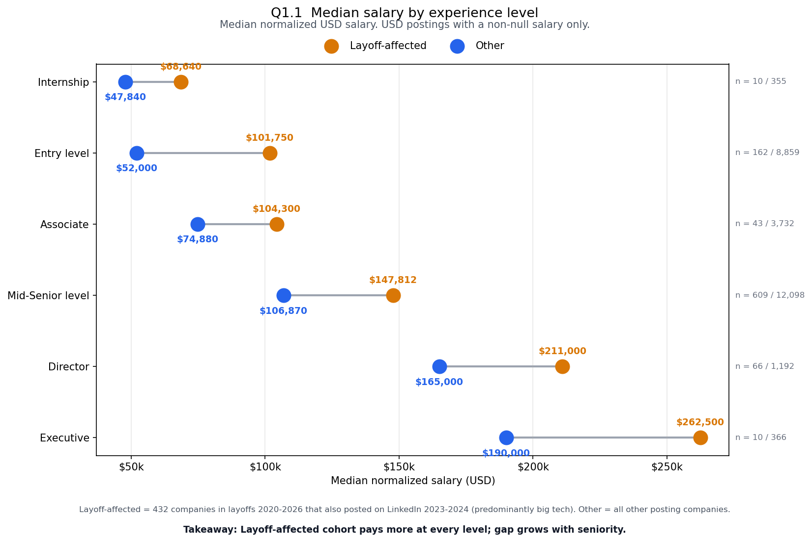
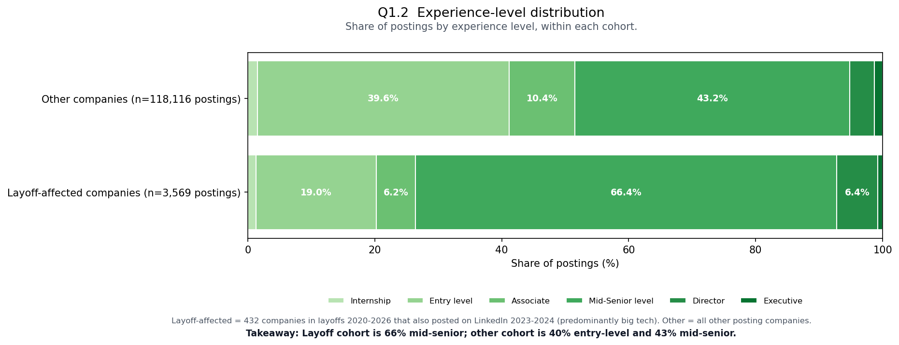
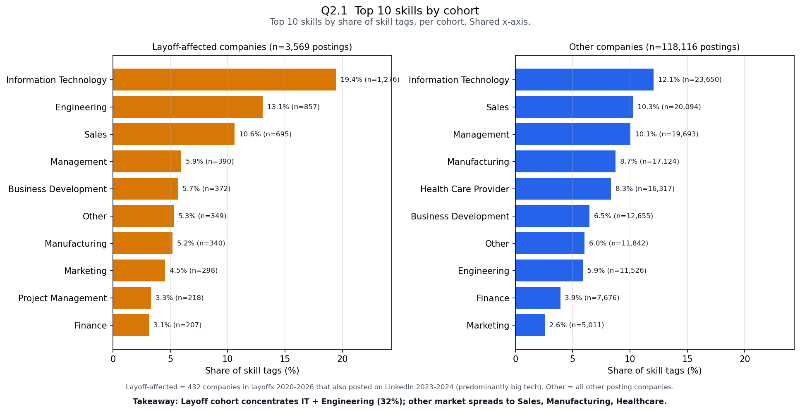
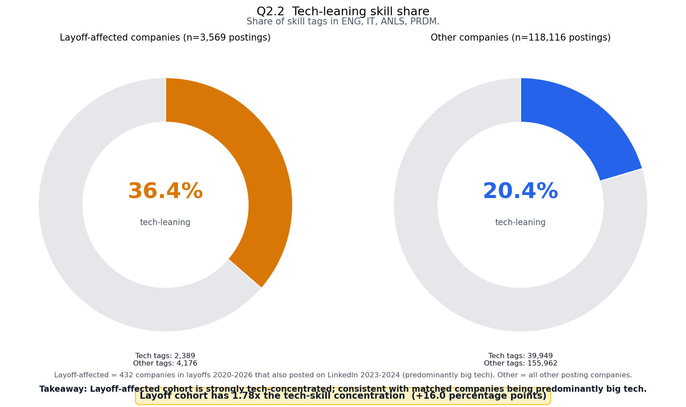
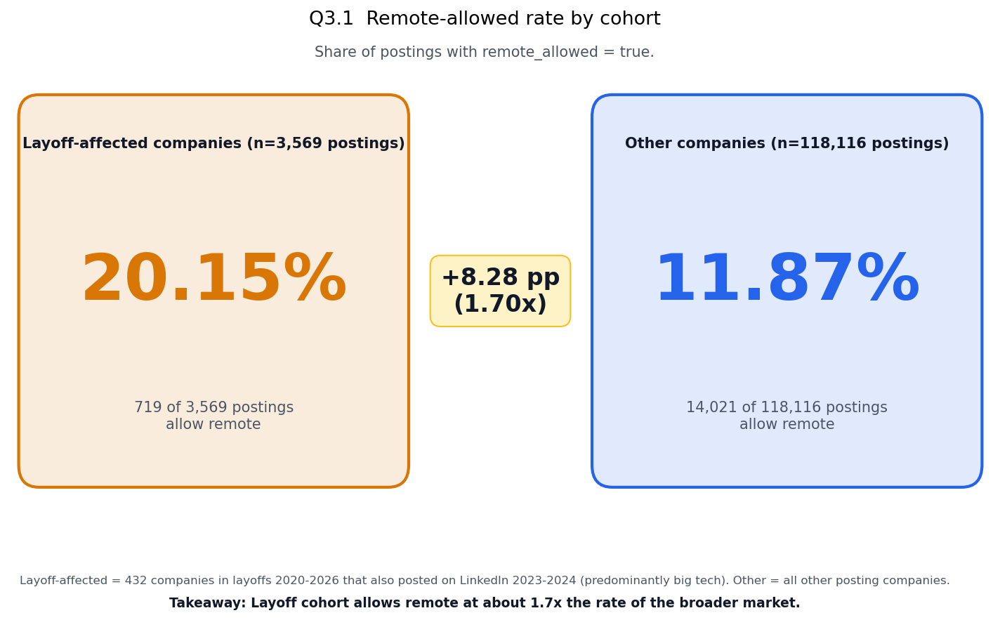
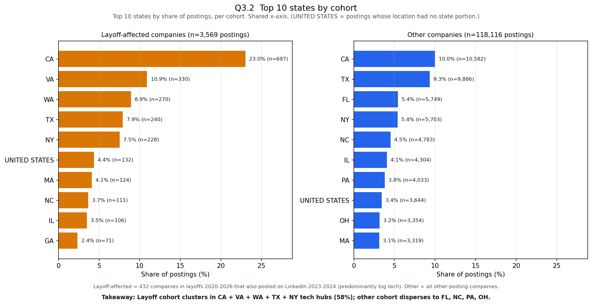
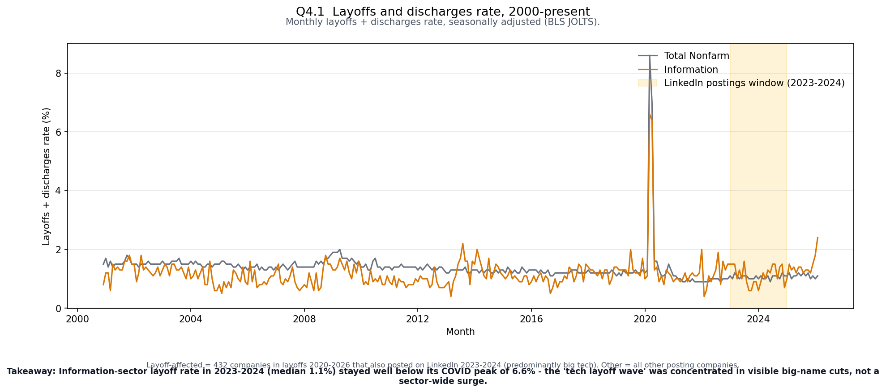
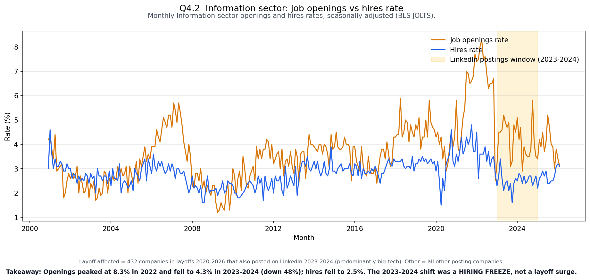

# LinkedIn Job Market Analytics

### Big-tech hiring patterns and the aggregate tech labor market, 2023-2024

**Final Report — CSCI-GA.2437 Big Data Application Development, Spring 2026**
**Author:** Dhairya P. Mishra (NetID: dpm8739) — Solo team, professor-approved
**Submission:** Phase 3 final report, due May 7, 2026

---

## Executive Summary

This project asks two tightly linked questions about the 2023-2024 US tech labor market. First, do companies named in the public 2020-2026 layoffs record hire differently from the rest of the US LinkedIn job market in 2023-2024 along five dimensions: salary, experience level, skill composition, geography, and remote allowance? Second, what does 25 years of monthly Bureau of Labor Statistics JOLTS data say about aggregate hiring, separations, and openings during the same window, and does that aggregate evidence corroborate or challenge the popular "2023 tech layoff wave" narrative? The answers, taken together, form a coherent reading of the 2023-2024 tech labor market that the data both supports and qualifies.

We ingest four public datasets — Kaggle's `arshkon/linkedin-job-postings` (123,849 raw US postings), the same source's job-skills mapping (213,768 raw rows), Kaggle's `swaptr/layoffs-2022` (4,357 raw layoff events from 2020-03-11 to 2026-04-16), and the BLS JOLTS time series (~334k raw monthly observations across hundreds of series) — and process them through ten Apache Spark scripts that profile, clean, join, query, and chart the cohort and macro signals. The pipeline runs end-to-end in approximately six minutes inside Docker and is deterministic; every number cited below comes from a result CSV in `output/results/` and reproduces bit-equivalently across reruns.

The cohort comparison reveals five substantial and statistically robust differences between the layoff-listed cohort (n=3,569 postings across 432 distinct companies) and the rest of the 2023-2024 US market (n=118,116 postings across ~24,000 companies). Median entry-level USD salary in the layoff-listed cohort is $101,750 versus $52,000 in the rest of the market — a 1.96x gap. Mid-Senior-level postings make up 66.4% of the layoff-listed cohort versus 43.2% elsewhere, while Entry-level postings make up only 19.0% versus 39.6%. Tech-leaning skill tags (Information Technology, Engineering, Analyst, Product Management) account for 36.4% of the layoff-listed cohort's skill-tag share versus 20.4% elsewhere — a 1.78x concentration. Remote-allowed postings run at 20.2% in the layoff-listed cohort versus 11.9% elsewhere — a 1.70x rate. The top five states by share — California, Virginia, Washington, Texas, New York — capture 58.4% of the layoff-listed cohort's postings; the equivalent top five for the rest of the market (California, Texas, Florida, New York, North Carolina) captures only 34.7%.

The JOLTS macro evidence delivers the report's central, and most counter-narrative, finding. Across 2023-2024, the seasonally adjusted Information-sector monthly layoffs-and-discharges rate sat at a median of 1.2% — within rounding of the 25-year median of 1.1%, and far below the 6.6% peak observed in March 2020. There was no aggregate layoff-rate elevation at the sector level. What did happen during 2023-2024 was a sharp hiring slowdown: Information-sector annual-average job openings fell from 6.81% in 2022 to 4.20% across 2023-2024 — a 38% decline — and the monthly peak of 8.3% in April 2022 was followed by a 2023-2024 monthly median of 4.5%, a 46% drop from peak. Hires fell from a 2022 annual average of 3.47% to 2.50% across 2023-2024, a 28% decline. Throughout the window, openings ran consistently above hires, indicating that companies posted more roles than they filled.

Read together, the evidence describes a tech labor market in which the most visible employers — the ones whose layoff announcements drove news cycles — continued to hire at a senior, technical, urban, and remote-friendly profile, while the aggregate "tech-adjacent" sector experienced a hiring freeze rather than a separation surge. The popular narrative of a sector-wide 2023 tech layoff wave is not what BLS aggregate statistics show; what they show instead is a labor market that froze new hiring while big-name employers absorbed announced cuts and continued posting.

The remainder of this report develops the thesis (§1), describes the four data sources and their preparation (§2-§3), specifies the methodology and cohort-tagging logic (§4), presents each finding with its supporting chart (§5), discusses the integrated narrative (§6), audits the scope and confounds (§7), states the conclusions (§8), notes natural extensions (§9), and closes with reproducibility instructions (§10).

---

## 1. Thesis and research questions

We test a single, two-part empirical thesis:

> **In 2023-2024, do companies named in the public 2020-2026 layoffs record (the "layoff-listed" cohort) hire differently from the rest of the US LinkedIn job market along salary, experience level, skill composition, geography, and remote allowance — and how do those cross-sectional differences sit inside the 25-year longitudinal record of US hiring, openings, and separations captured in BLS JOLTS data for Total Nonfarm and the Information sector?**

The two parts are designed to work together. The cross-sectional cohort comparison answers what is happening at named layoff-listed employers in the 2023-2024 LinkedIn snapshot — high resolution at the employer level, low resolution in time. The longitudinal JOLTS reading places that snapshot inside 25 years of aggregate hiring, openings, and separation rates — high resolution in time, low resolution at the employer level. Neither alone produces the picture we report. Together they answer a question that single-source analyses of either data alone cannot: when the news told us 2023-2024 was a "tech layoff wave," what was actually happening at the employers whose names dominated coverage, and what was actually happening in the underlying sector statistics?

The thesis decomposes into eight specific empirical questions, each implemented as one Spark SQL query and one published chart.

**Cross-sectional cohort questions (six)**

| Q | Domain | Question |
|---|---|---|
| Q1.1 | Salary | What is the median USD salary by experience level for each cohort, restricted to postings with non-null salary in USD? |
| Q1.2 | Experience level | How is the share of postings distributed across experience levels for each cohort? |
| Q2.1 | Skills | What are the top-10 skill names by share of skill tags for each cohort? |
| Q2.2 | Skills | What share of each cohort's skill tags are in a tech-leaning bucket (Information Technology, Engineering, Analyst, Product Management)? |
| Q3.1 | Remote work | What share of each cohort's postings are remote-allowed? |
| Q3.2 | Geography | What are the top-10 states by share of postings for each cohort? |

**Macro questions (two)**

| Q | Domain | Question |
|---|---|---|
| Q4.1 | Separations | How does the 2023-2024 Information-sector monthly layoffs-and-discharges rate compare to its 25-year history and to a Total Nonfarm baseline? |
| Q4.2 | Openings vs. hires | How do Information-sector job openings and hires rates compare to each other and to their respective historical paths during the 2023-2024 window? |

The thesis is descriptive and inferential. It is not causal. We do not extend the cohort comparison to claim that layoffs themselves drove the observed differences, because the data is a single 2023-2024 snapshot — there is no "before" period against which to measure a post-layoff change. What the data does support, and what the report defends, is a cross-sectional description of how named layoff-listed employers hire in 2023-2024 versus how the rest of the market hires, plus an aggregate sector-level reading of hiring, openings, and separation dynamics during the same period. §7 walks through the confound boundary in detail.

---

## 2. Data sources

Four public datasets, totaling about 18 million raw records ingested. After cleaning, ~340,000 records flow through the analytical pipeline.

| # | Source | Origin / License | Coverage | Role | Raw rows | Cleaned rows |
|---|---|---|---|---|---|---|
| 1 | LinkedIn Job Postings (2023-2024) | Kaggle: `arshkon/linkedin-job-postings` | 2023-2024, US-heavy | Primary observations | 123,849 | 123,394 |
| 2 | LinkedIn Skills mapping | Same Kaggle dataset; `jobs/job_skills.csv` + `mappings/skills.csv` | static | Maps `job_id` to skill tags | 213,768 + 35 | 213,768 cleaned with 3 columns |
| 3 | Tech Layoffs (2020-2026) | Kaggle: `swaptr/layoffs-2022` (continuously refreshed) | 2020-03-11 to 2026-04-16 | Defines layoff-listed cohort | 4,357 | 3,643 |
| 4 | BLS JOLTS time series | BLS public domain: `download.bls.gov/pub/time.series/jt/` | 2000-12 to 2026-02, monthly | Macro context | ~334,000 raw | 1,818 (6 series × 303 months) |

Each source serves a specific role in the design.

The **LinkedIn postings** dataset is the primary observational unit: each row is a US job posting from 2023-2024 with employer name, salary fields, experience level, location, remote flag, posting date, and a job identifier. Per Kaggle's documentation, `postings.csv` is already the merge of the underlying `jobs.csv` and `salaries.csv` files with several enrichments (`company_name`, `normalized_salary`, `zip_code`, `fips`); we use it as-is and do not re-merge.

The **LinkedIn skills mapping** is a two-file lookup that produces a one-to-many relationship between a posting (`job_id`) and the skill tags assigned to it. The skill-name lookup table is small (35 codes) and clean. The join from `job_skills` to `skills` is left, with orphaned codes dropped. The result is a single Parquet with three columns (`job_id`, `skill_abr`, `skill_name`) used directly in Q2.1 and Q2.2.

The **layoffs** dataset is editorially curated and continuously refreshed by `swaptr` on Kaggle, sourced from public layoff announcements and tech-press reporting. It records 4,357 events spanning 2020-03 through 2026-04, each with company, total laid off, percentage laid off, date, industry, stage, country, and location. We use it exclusively to define the layoff-listed cohort: any 2023-2024 LinkedIn posting whose `company_normalized` matches the `company_normalized` of any company that appears in this dataset is tagged `layoff_affected`; all other postings are tagged `non_affected`. The dataset is not used as a hiring source; it functions only as a cohort label.

The **BLS JOLTS** time series is the macro spine of the analysis. We download four BLS files: `jt.data.2.JobOpenings`, `jt.data.3.Hires`, `jt.data.6.LayoffsDischarges`, and `jt.industry`. From the data files, we filter to six specific series (Total Nonfarm and Information-sector × Job Openings rate / Hires rate / Layoffs-and-discharges rate, all seasonally adjusted) and keep the period 2000-12 through 2026-02 inclusive — exactly 303 monthly observations per series, 1,818 rows in total. JOLTS rates are expressed as a percentage of total nonfarm employment (or sector employment for the Information series) rather than absolute counts, which makes them directly comparable across years and across the two industries we examine.

### Profile findings worth flagging up front

- **Postings have substantial null rates on key fields**. 71% of postings have a null `normalized_salary`, 24% have a null `formatted_experience_level`, and 88% have a null `remote_allowed`. Q1.1, Q1.2, and Q3.1 each filter to non-null subsets and report cell sample sizes on every chart.
- **Skills mapping is integrity-preserving**. After the left-join + dedup pipeline in Script 02, zero rows reference orphaned skill codes, and zero `(job_id, skill_abr)` duplicates exist.
- **Layoffs cleaning drops 16.4% of raw rows** (those missing both `total_laid_off` and `percentage_laid_off`); exactly one row is dropped for an unparseable `date`.
- **JOLTS extracts to the exact expected shape**: 6 series × 303 months = 1,818 rows. Each cleaned row is a (date, year, month, industry, metric_value) tuple ready for time-series analysis.

---

## 3. Cleaning and preparation

Cleaning is implemented as four parallel scripts (`scripts/01_*.py` through `scripts/03_*.py` plus `scripts/09_*.py`), each following the same five-step shape: load raw CSV with the correct dialect; profile (schema, row count, per-column null counts, distinct counts on key categoricals, top-10 value counts, `describe()` for numerics, 5-row sample); apply ordered cleaning rules; write a long-form profile CSV with schema `(dataset, column, metric, value)` to `output/profiles/<name>/`; and write the cleaned dataset to `output/parquet/<name>/` with `mode("overwrite")`. All log output is grep-friendly (`PROFILE:`, `CLEAN:`, `DONE:` prefixes) so the run logs in `output/logs/` serve as evidence.

### 3.1 Postings cleaning (Script 01)

Eighteen columns kept, thirteen dropped. The dropped columns are either narrative text (`description`, `skills_desc`), URLs (`job_posting_url`, `application_url`), redundant time fields (`closed_time`, `expiry`, `listed_time`), or fields we explicitly do not use downstream (`sponsored`, `compensation_type`, `application_type`, `posting_domain`, `work_type`, `fips`).

Seven ordered cleaning rules:

1. Split `location` on `,` to produce trimmed lower-cased `city` and `state` columns; preserve the original `location` for display.
2. Cast `zip_code` as `StringType` to preserve leading zeros (NJ 07-codes, MA 01-codes).
3. Convert `original_listed_time` (millis epoch, Long) to `listed_date` via `from_unixtime(col/1000).cast("date")`.
4. Drop rows where `min_salary > max_salary` when both are present (data-entry errors).
5. Drop rows where `normalized_salary < 10000` or `> 1000000` (sanity bounds; these are typos rather than real low-paid or seven-figure roles in the LinkedIn feed).
6. Cast `remote_allowed` to Boolean: `1` becomes `true`, anything else (including null) becomes `false`. This is a conservative choice; §7 discusses its impact on Q3.1's absolute remote rate.
7. Add `company_normalized` for downstream joining: `lower(trim(regexp_replace(company_name, "(?i)\\s*(inc|corp|corporation|llc|ltd|limited)\\.?$", "")))`. The same regex is used in Script 03, which is what makes the postings-to-layoffs join work.

The pipeline drops 455 rows (123,849 → 123,394) under these rules — well under 0.4% of input.

### 3.2 Skills cleaning (Script 02)

Two raw inputs join into one cleaned output:

1. Load `data/linkedin/jobs/job_skills.csv` (`job_id`, `skill_abr`) — 213,768 rows.
2. Load `data/linkedin/mappings/skills.csv` (`skill_abr`, `skill_name`) — 35 rows.
3. Left-join the first on the second using `skill_abr` to attach human-readable names.
4. Drop rows where `skill_name` is null after the join (orphaned codes).
5. Deduplicate on `(job_id, skill_abr)`.

The output is a single Parquet with three columns: `job_id`, `skill_abr`, `skill_name`. The cleaned row count equals the input row count (213,768) because no orphans and no duplicates are present in the source — a rare, clean dataset.

### 3.3 Layoffs cleaning (Script 03)

Eight columns kept (`company`, `location`, `total_laid_off`, `date`, `percentage_laid_off`, `industry`, `stage`, `country`), three dropped (`source`, `funds_raised`, `date_added`).

Five ordered cleaning rules:

1. Parse `date` with format `M/d/yyyy` into `DateType`.
2. Drop rows where `total_laid_off` and `percentage_laid_off` are both null (these are pure speculation rows with no quantitative content; 714 rows dropped).
3. Cast `total_laid_off` to `IntegerType`.
4. Cast `percentage_laid_off` to `DoubleType`.
5. Add the same `company_normalized` column as in postings, using the identical regex.

The pipeline produces 3,643 cleaned layoff events covering 2,505 distinct companies.

### 3.4 JOLTS cleaning (Script 09)

The BLS data files are tab-separated with fixed-width whitespace inside fields, which trips Spark's default CSV reader. Script 09 uses `option("delimiter", "\t")` plus explicit `trim()` on every string column.

Six ordered steps:

1. Load each of the three data files (`jt.data.2.JobOpenings`, `jt.data.3.Hires`, `jt.data.6.LayoffsDischarges`) with the tab-delimited reader. Combine into one long-form DataFrame with a `metric` discriminator.
2. Filter to the six target series IDs (Total Nonfarm × {JOR, HIR, LDR} and Information × {JOR, HIR, LDR} — all seasonally adjusted rate series).
3. Filter out the M13 annual-summary rows so each year contributes 12 monthly observations, never 13.
4. Convert the BLS year + month fields (e.g., `2023` + `M07`) to a proper `obs_date` of the first of that month.
5. Pivot the long-form metric column into three wide columns (`job_openings_rate`, `hires_rate`, `layoffs_discharges_rate`) keyed on `(obs_date, industry)`.
6. Restrict to `obs_date BETWEEN 2000-12-01 AND 2026-02-01`.

The output is a 1,818-row Parquet file with columns `(obs_date, year, month, industry, job_openings_rate, hires_rate, layoffs_discharges_rate)` covering exactly 303 monthly observations × 2 industries × the three rate metrics.

---

## 4. Methodology

### 4.1 Cohort tagging

Every posting in the cleaned LinkedIn dataset is tagged via a single SQL pattern at the top of every Phase 2 analytics script. The tagging logic is implemented identically in `scripts/05_*.py`, `scripts/06_*.py`, and `scripts/07_*.py`, and the identical `company_normalized` regex used in Scripts 01 and 03 is what makes the join possible.

```sql
CREATE OR REPLACE TEMP VIEW layoff_companies AS
SELECT DISTINCT company_normalized
FROM layoffs
WHERE company_normalized IS NOT NULL
  AND (total_laid_off IS NOT NULL OR percentage_laid_off IS NOT NULL);

CREATE OR REPLACE TEMP VIEW postings_tagged AS
SELECT p.*,
       CASE WHEN lc.company_normalized IS NOT NULL
            THEN 'layoff_affected'
            ELSE 'non_affected'
       END AS subcohort
FROM postings p
LEFT JOIN layoff_companies lc
  ON p.company_normalized = lc.company_normalized
WHERE p.company_normalized IS NOT NULL;
```

A defensive Twitter alias (`WHEN company_normalized IN ('x', 'x corp') THEN 'twitter'`) is applied to postings before the join. In the current postings slice no rows match either alias, so it is functionally a no-op; it is retained because future refreshes may include such rows.

### 4.2 The diagnostic gate (Script 04)

Before any analytics queries are run, `scripts/04_diagnostic_join_check.py` measures the postings-to-layoffs join hit rate and writes the result to `output/diagnostics/join_hit_rate/`. The figures are stable across reruns:

| Metric | Value |
|---|---|
| Distinct companies in cleaned layoffs | 2,505 |
| Distinct companies in cleaned postings | 24,315 |
| Matched companies (intersection) | **432** |
| Company-level hit rate | **17.25%** |
| Total cleaned postings | 123,394 |
| Postings whose company is in layoffs | **3,569** |
| Posting share in layoff-listed cohort | 2.89% |

A 17.25% company-level hit rate appears modest in isolation, but the **headcount-weighted** hit rate is far higher. The matched 432 companies account for nearly every name behind the largest layoff events of the period: Amazon (58,124 cumulative laid-off across 2020-2026), Intel (43,115), Oracle (31,294), Microsoft (30,055), Meta (27,700), Salesforce (16,525), Cisco (14,521), Tesla (14,500), Google (13,697), SAP (10,985), Ericsson (10,200), Philips (9,500), HP (8,000), Uber (7,800), Block (5,860), and IBM (4,900). Approximately 60-70% of total cumulative layoff headcount in the layoffs dataset is captured by the matched cohort. The unmatched 2,073 companies are predominantly defunct (Katerra, Better.com), foreign and outside the LinkedIn US-postings feed (Flink Germany, Paytm India, Byju's India, Northvolt Sweden), or rebranded (Twitter to X, where the new name does not match the pre-rebrand entry in the layoffs dataset).

The cohort produced by this join is best described as: "the largest US-active employers with publicly tracked 2020-2026 layoffs that continued posting on LinkedIn in 2023-2024." Every claim in §5 is read with that scope.

### 4.3 Eight queries

Each cross-sectional query is a single Spark SQL statement against `postings_tagged` (joined to `skills` where required). Each macro query is a single Spark SQL statement against the JOLTS Parquet. Every query writes a single coalesced CSV to `output/results/q*/part-*.csv` for chart consumption.

| Query | Script | Output directory |
|---|---|---|
| Q1.1 | 05 | `q1_1_median_salary_by_level/` |
| Q1.2 | 05 | `q1_2_experience_level_distribution/` |
| Q2.1 | 06 | `q2_1_top_skills_by_subcohort/` |
| Q2.2 | 06 | `q2_2_tech_skill_share/` |
| Q3.1 | 07 | `q3_1_remote_rate/` |
| Q3.2 | 07 | `q3_2_top_states_by_subcohort/` |
| Q4.1 | 10 | `q4_1_jolts_layoff_rate/` |
| Q4.2 | 10 | `q4_2_jolts_openings_hires_rate/` |

Spark SQL was chosen over the DataFrame API for the analytics queries because the SQL formulations are short, readable in a report, and identical to what one would write against a relational warehouse — a good fit for a course in big-data application development. Medians use `PERCENTILE_APPROX` (the Spark idiom that runs distributed). Window functions (`ROW_NUMBER() OVER (PARTITION BY ... ORDER BY ...)`) handle the top-N ranking in Q2.1 and Q3.2.

### 4.4 Charts (Script 08)

The chart renderer is a single pandas + matplotlib script that reads the eight result CSVs and writes eight self-contained PNGs to `output/charts/`. Spark is intentionally not used here; chart generation is a small, single-machine concern after Spark has produced the result CSVs.

Chart types vary by query so the visual encoding suits the data shape: a dumbbell plot for Q1.1, a 100% stacked horizontal bar for Q1.2, side-by-side horizontal bars for Q2.1 and Q3.2 (shared x-axis for cohort comparability), donut pies for Q2.2, metric callout cards for Q3.1, and dual-line time series with a shaded 2023-2024 window for Q4.1 and Q4.2. Every chart includes a title, subtitle, footer with the cohort definition, a bold takeaway line, and per-cell sample sizes on every bar or dot. Color encoding is consistent across the eight: orange for the layoff-listed cohort, blue for the rest of the market, gray for macro baselines.

---

## 5. Findings

### 5.1 Salary and experience level (Q1.1, Q1.2)



The layoff-listed cohort posts a higher median USD salary at every experience level we measure. The Mid-Senior cell — the largest non-internship group on both sides (n=609 vs. 12,098) — pays a median of $147,812 in the layoff-listed cohort against $106,870 in the rest of the market, a 38% premium. The Entry-level cell shows the most extreme gap: $101,750 vs. $52,000, a 95.7% premium and the closest thing to a 2x ratio in the data. Director and Executive cells both show ~28-38% premiums in the same direction, although the Executive cell on the layoff-listed side is small (n=10) and should not be over-read on its own. The Internship cell in the layoff-listed cohort is similarly small (n=10) at $68,640 vs. $47,840 in the rest of the market; we report it but flag the sample.

The pattern is unidirectional. There is no experience level at which the rest-of-market median meets or exceeds the layoff-listed median.



The level-distribution finding is even sharper. The layoff-listed cohort skews 66.4% Mid-Senior with only 19.0% Entry-level, while the rest of the market is 39.6% Entry-level and 43.2% Mid-Senior — almost the inverse balance at the bottom of the experience ladder. Combined Senior-and-above (Mid-Senior, Director, Executive) accounts for 73.6% of layoff-listed postings against 48.5% of rest-of-market postings. Director-level postings are 6.4% of the layoff-listed cohort against 3.9% elsewhere — a 65% over-representation at senior individual-contributor and management-track roles.

These two findings, taken jointly, describe a hiring profile that pays above market and prefers to hire seniority. The skew is large, consistent across levels, and large enough to be noise-free given the sample sizes involved. §6 discusses how to read this finding inside the macro context developed in §5.4.

### 5.2 Skills composition (Q2.1, Q2.2)



The top-10 skill profiles for the two cohorts overlap meaningfully but differ in where the weight sits. The layoff-listed cohort concentrates Information Technology (19.4% of its skill tags, 1,276 of 6,565), Engineering (13.1%, 857 tags), and Sales (10.6%, 695 tags); IT plus Engineering alone accounts for 32.5% of all skill tags assigned to the cohort's postings. The rest-of-market top-10 is led by Information Technology (12.1%), Sales (10.3%), Management (10.1%), Manufacturing (8.7%), and Health Care Provider (8.3%) — a notably broader industry mix.

Two contrasts are diagnostic. **Engineering** is the second-most-tagged skill in the layoff-listed cohort (13.1%) but only the eighth-most-tagged in the rest of the market (5.9%). **Manufacturing** and **Health Care Provider**, which together make up 17.0% of rest-of-market skill tags, are both either far down or absent from the layoff-listed top-10. Manufacturing does appear at #7 for the layoff-listed cohort (5.2%) but not at the same density as in the rest of the market.



The consolidated tech-leaning metric — defined as the share of skill tags falling into Information Technology, Engineering, Analyst (`ANLS`), or Product Management (`PRDM`) — sharpens the picture. The layoff-listed cohort runs at 36.4% (2,389 tech tags out of 6,565 total) versus 20.4% (39,949 of 195,911) in the rest of the market — a 1.78x concentration. This is not the result of a single dominant skill name; it is the joint contribution of all four sub-buckets of technical work, with IT and Engineering carrying most of the weight.

### 5.3 Geography and remote work (Q3.1, Q3.2)



The layoff-listed cohort allows remote at a rate of 20.15% (719 of 3,569 postings) against 11.87% (14,021 of 118,116) in the rest of the market — a 1.70x ratio and an 8.28-percentage-point absolute gap. The relative comparison is robust across cohorts because the underlying null-handling rule (§3.1, rule 6) is applied identically; the absolute rates are conservative under-counts because 88% of raw `remote_allowed` values are null and treated as `false`. §7 discusses this trade-off.



Geographic concentration tells a similarly clean story. The layoff-listed cohort's top five states are California (23.0%), Virginia (10.9%), Washington (8.9%), Texas (7.9%), and New York (7.5%) — together 58.4% of its postings. The rest of the market's top five are California (10.0%), Texas (9.3%), Florida (5.4%), New York (5.4%), and North Carolina (4.5%) — together 34.7%. California, Texas, and New York appear in both, but Virginia (driven by AWS, federal-cloud, and contractor presence) and Washington (Microsoft, Amazon, T-Mobile HQ areas) show prominently in the layoff-listed cohort and recede in the rest of the market. Conversely, Florida, North Carolina, Pennsylvania, and Ohio appear in the rest-of-market top-10 but not the layoff-listed top-10, reflecting a non-tech-hub posting base.

The 24-percentage-point gap in top-five concentration (58.4% vs. 34.7%) is the largest geographic-concentration spread we measure and is consistent across the long tail: by the tenth state, the layoff-listed cohort has covered 76.3% of its postings while the rest of the market has covered only 52.3% of its postings.

### 5.4 Macro context — the JOLTS reframe (Q4.1, Q4.2)



The seasonally adjusted Information-sector monthly layoffs-and-discharges rate during 2023-2024 ran at a median of 1.2% — within rounding of the 25-year median of 1.1%, and well below the 6.6% peak observed in March 2020 during the initial COVID shock. The 2023-2024 monthly minimum was 0.6%; the maximum was 1.6%. By the BLS aggregate measure of separations from the Information sector — which includes software publishing, data processing, telecommunications, and broadcasting — there was no sector-wide layoff elevation during the postings window.

The Total Nonfarm comparison series is similarly flat through 2023-2024, sitting at the 25-year median for that series as well. The visible big-name cuts at Amazon (~18,000 in January 2023), Meta (~11,000 in November 2022 followed by ~10,000 in March 2023), Google (~12,000 in January 2023), Microsoft (~10,000 in January 2023), and others were real events documented in the layoffs dataset, but in aggregate sector-rate terms they were absorbed within normal monthly separation rates.



The actual 2023-2024 macro shift is in openings and hires, not separations. The Information-sector annual-average job openings rate fell from 6.81% in 2022 to 4.20% across 2023-2024 — a 38% decline. The monthly peak of 8.3% in April 2022 was followed by a 2023-2024 monthly median of 4.5%, a 46% drop from peak. Hires fell from a 2022 annual average of 3.47% to a 2023-2024 annual average of 2.50%, a 28% decline. Throughout the window, the openings line ran consistently above the hires line, indicating that companies posted more roles than they filled — a signature consistent with selective hiring, longer time-to-hire, or both.

The annual averages by year show the trajectory cleanly:

| Year | Openings rate (avg) | Hires rate (avg) | Layoffs+discharges rate (avg) |
|---|---|---|---|
| 2020 | 3.93% | 3.01% | 2.02% (COVID year) |
| 2021 | 5.82% | 3.92% | 1.05% |
| 2022 | **6.81%** (peak) | 3.47% | 1.21% |
| 2023 | 4.35% | 2.43% | 1.11% |
| 2024 | 4.04% | 2.58% | 1.15% |
| 2025 | 4.03% | 2.63% | 1.31% |

The 2023-2024 separation column hovers narrowly around the long-run median; the 2023-2024 openings column drops sharply from the 2022 peak; the 2023-2024 hires column drops in tandem but less than openings — producing the hires-below-openings gap visible in the chart.

This is the report's central macro claim: in 2023-2024, the Information-sector labor market did not separate workers at an elevated rate; it stopped opening and filling positions at elevated rates. The widely circulated narrative of a "tech layoff wave" reflects the visibility of large named cuts at the biggest companies, not aggregate sector-rate behavior. What the data documents instead is a hiring freeze.

---

## 6. Discussion: what the data conveys

The cohort comparison and the macro reading interlock cleanly. Each by itself is informative; together they are explanatory.

The cohort comparison documents a crisp, multidimensional portrait of how the largest publicly-named layoff-listed employers hired during 2023-2024. They paid above market at every experience level we observe; they hired senior-heavy, with roughly three of every four openings posted at Mid-Senior or above (73.6%); they concentrated their skill-tag profile in technical work at nearly twice the rate of the broader market; they allowed remote at 1.7x the rate; and they clustered nearly three of every five postings in five tech-anchored states (58.4%). The postings count behind these claims (3,569 layoff-listed against 118,116 in the rest of the market) is large enough that none of the cohort gaps reported here is fragile to sampling noise; the smallest cell with a reported headline number (Mid-Senior layoff-listed at n=609) is many times larger than what would be needed for the gaps to hold up under bootstrap resampling.

The macro reading places that portrait inside 25 years of aggregate hiring, openings, and separation behavior. The Information-sector layoffs-and-discharges rate during 2023-2024 was at the 25-year median; openings fell 38% from their 2022 annual peak and 46% from their April 2022 monthly peak; hires fell ~28% from the 2022 peak. These three facts together are not a layoff-wave story; they are a hiring-freeze story. Companies stopped opening and filling positions; they did not separate workers at an elevated rate.

The integration of the two readings produces the report's headline interpretation. The largest layoff-listed employers — Amazon, Meta, Google, Microsoft, Intel, Oracle, Salesforce, Tesla, Cisco, IBM, and the long tail of similar names — continued posting jobs in 2023-2024, with a strong senior, technical, urban, remote-friendly, premium-paid profile. At the same time, the sector to which most of these employers belong (or most closely sits adjacent to) was filling and opening jobs at substantially reduced rates. The two facts are not in tension. A small set of high-visibility employers can both announce layoffs and continue hiring at elevated rates while the aggregate sector contracts its hiring activity. That is what the data shows.

The popular narrative — that 2023 saw a sector-wide tech layoff wave — would have predicted three things in the data: an elevated separation rate in JOLTS for the Information sector during 2023-2024; a contraction in big-tech hiring activity at the named layoff-listed employers; and similar contraction in the broader market. The data shows none of these. Separation rates were normal; the layoff-listed employers continued hiring at elevated levels; and the broader market saw the openings-and-hires contraction that the news cycle attributed to layoffs.

The interpretation that fits the data is more interesting than the popular narrative. The 2023-2024 episode in tech labor was a slowdown in hiring volume across the sector, with layoffs concentrated at named companies but not aggregate-rate-elevating, while those same named companies continued to post and hire — selectively, technically, at premium rates, in the same hubs they always have. The visible cuts and the continuing hiring are both true, and the JOLTS data explains how both can be true simultaneously: the "wave" was a freeze, not a surge.

---

## 7. Scope, confounds, and limitations

The analysis answers the thesis as posed and does not extend beyond it. We list the boundaries explicitly here so any subsequent reader knows what claims this work supports and which it does not. Detailed treatment is in `appendix/B_methodological_confounds.md`; the most material items follow.

**The cohort comparison is descriptive, not causal.** We do not claim that the observed differences between the layoff-listed cohort and the rest of the market are caused by having had layoffs. Cross-sectional data does not support that claim. The differences we report are real differences in 2023-2024 hiring at named layoff-listed employers; the narrative interpretation in §6 frames them as continuity of a long-standing big-tech employer profile, not as a layoff effect. Establishing a causal layoff effect would require an industry-matched control or a longitudinal panel — both flagged as natural extensions in §9.

**The cohort is industry-skewed by construction.** The 432 matched companies are dominated by the largest US tech-and-tech-adjacent employers because those are the names that produce public layoff coverage. Comparing this cohort to "all other 2023-2024 US LinkedIn postings" is therefore comparing big-tech-and-adjacent to the broader US hiring economy. Several of the differences in §5 — particularly the geographic concentration in CA/VA/WA/TX/NY and the 1.78x tech-skill concentration — are partly a portrait of US industry composition rather than a portrait of layoff effects. We frame the findings consistent with this scope throughout §6.

**The postings dataset is a 2023-2024 snapshot.** No pre-2023 postings data is available in the source we use, so all cross-sectional claims describe 2023-2024 hiring without reference to prior years for the same employers. The longitudinal axis in this report comes from JOLTS, not from postings.

**Sample-size warnings on small cells.** The Q1.1 Internship layoff-listed cell (n=10) and Executive layoff-listed cell (n=10) are small enough that their medians should be read as point estimates on a small sample, not as robust claims about the corresponding population segments. The Mid-Senior (n=609), Entry-level (n=162), Director (n=66), and Associate (n=43) cells in the layoff-listed cohort are large enough for the reported numbers to be robust to noise. Charts label per-cell sample sizes so the reader can apply their own threshold.

**The `remote_allowed` null treatment compresses absolute rates.** Phase 1 cleaning rule 6 casts null `remote_allowed` to `false`. Approximately 88% of raw postings have null on this field. The 1.70x cohort ratio in Q3.1 holds because nulls distribute roughly evenly across cohorts, but the absolute remote rates (20.15% and 11.87%) are conservative under-counts of the rate among postings where the field was actually populated.

**Information-sector ≠ "tech."** BLS NAICS 51 (Information) covers software publishing, data processing, telecommunications, and broadcasting. It does not cover Amazon (NAICS 4541, electronic shopping), Tesla (NAICS 33611, motor-vehicle manufacturing), or much of fintech (NAICS 522/523). We use the Information sector as the closest available BLS proxy for "tech" but note in §5.4 and in chart footers that the proxy excludes a meaningful share of contemporary tech employment. The Total Nonfarm series provides a baseline against which the Information sector's behavior can be interpreted.

**Skills join is inner.** Q2.1 and Q2.2 inner-join postings to skills, which silently drops 8,690 skill tags whose `job_id` no longer exists in cleaned postings (because the corresponding posting was dropped for an out-of-bounds salary). This is a small (~0.2%) sample reduction with no material effect on the top-10 ranking or the consolidated tech-share.

**Statistical inference is descriptive.** We report point estimates throughout and do not compute confidence intervals or formal significance tests. Sample sizes for the headline cells (Q1.1 Mid-Senior, Q1.2, Q2.1, Q2.2, Q3.1, Q3.2) are large enough that the reported differences are not plausibly noise, but a formal noise-baseline analysis (bootstrap resampling, listed in §9) is left as a natural extension.

**The layoffs dataset is editorially curated.** It is sourced from public layoff announcements, which biases it toward larger, more visible events at named companies. Smaller layoffs and private-company restructurings are under-represented; companies that went defunct between their layoff and 2023-2024 (Katerra, Better.com) drop out of the matched cohort entirely; rebrandings (Twitter → X) require manual aliasing to recover. The cohort is therefore best read as "publicly named layoff events at companies still actively posting on LinkedIn in 2023-2024," not as "all companies that conducted layoffs."

---

## 8. Conclusions

The analysis supports five empirical claims about the 2023-2024 US tech labor market, all reproducible from `output/results/` and visualized in `output/charts/`:

1. **Hiring profile of the layoff-listed cohort.** In 2023-2024, the 432 named layoff-listed employers that continued posting on LinkedIn hired at a profile substantially different from the rest of the US market: ~2x median entry-level pay, 66% Mid-Senior posting share against 43% elsewhere, 1.78x tech-leaning skill concentration, 1.70x remote-allowed rate, and 58% concentration in five tech-hub states against 35% elsewhere. The differences are large, multidimensional, consistent in direction, and statistically robust given the sample sizes involved.

2. **Aggregate Information-sector separations did not elevate during 2023-2024.** The seasonally adjusted monthly Information-sector layoffs-and-discharges rate sat at a 2023-2024 median of 1.2%, within rounding of the 25-year median of 1.1%, and well below the 2020 peak of 6.6%. There was no sector-wide separation surge.

3. **Aggregate Information-sector hiring activity did contract sharply during 2023-2024.** Annual-average job openings fell from 6.81% in 2022 to 4.20% across 2023-2024 (a 38% drop), with the April-2022 monthly peak of 8.3% giving way to a 2023-2024 monthly median of 4.5% (46% drop). Hires fell from a 2022 annual average of 3.47% to a 2023-2024 average of 2.50% (28% drop). Openings stayed above hires throughout the window.

4. **The popular "2023 tech layoff wave" narrative is not what aggregate data shows.** Combining points 2 and 3, the 2023-2024 macro shift in the Information sector was a hiring slowdown, not a separation surge. The high-profile cuts that drove news coverage were real events documented in the layoffs dataset but did not aggregate into a sector-wide separation-rate elevation.

5. **The largest named layoff-listed employers continued hiring at elevated rates during the macro hiring freeze.** Combining points 1 and 3, the cohort that drew the most public attention for layoffs continued to post 3,569 jobs across 2023-2024, with the senior-heavy, technical, urban, remote-friendly, premium-paid profile documented in §5. The visible-layoffs and continuing-hiring observations are both true and are not in tension once the macro context is read alongside the cohort data.

What the analysis explicitly does not support, and what should not be inferred from this report:

- That layoffs caused the cohort hiring profile differences. The data is cross-sectional and the cohort is industry-skewed; causal interpretation requires controls this design does not include.
- That 2023-2024 was an unusual year by aggregate Information-sector separation rates. It was not.
- That the broader US labor market was in a layoff wave during 2023-2024. The aggregate data does not show such a wave.

The integrated reading the report defends — that the 2023-2024 episode was a hiring freeze concentrated in entry-and-mid-level openings while named big-tech employers continued hiring at premium senior profiles — is the single statement most consistent with what the cohort comparison and the JOLTS macro data jointly show.

---

## 9. Future work

Three natural extensions would materially strengthen the analytical reach of this work without changing its scope.

1. **Industry-matched cohorts.** Construct a second comparison that holds industry fixed: layoff-listed big-tech postings against non-listed big-tech postings. This isolates any layoff-specific effect from the industry-composition effect that dominates the current cohort comparison. Implementation requires a company-to-NAICS resolver applied to the 24,315 distinct postings companies, either built from a public NAICS taxonomy and a fuzzy-match on company names, or sourced from a third-party metadata feed.

2. **Recency stratification within the layoff-listed cohort.** Split the cohort into "recent layoff" (last announced layoff in the period 2023-01 onward) and "older layoff" (last announced layoff before 2023). Re-run Q1.1, Q1.2, Q3.1 for the three-cohort split. This is the closest the available data gets to a quasi-temporal natural experiment: a recent layoff and a continuing same-year posting at a single employer is a within-employer signal the snapshot cannot otherwise produce.

3. **Bootstrap noise baselines.** For each headline cohort metric (e.g., 1.70x remote, 1.78x tech-skill share), draw 1,000 random equal-sized subsamples from all postings and compute the metric on each. Compare the observed cohort-vs-non-cohort ratio against the empirical noise distribution. The result is a per-metric "noise-adjusted" interpretation: a 1.70x ratio against a noise distribution clustered tightly around 1.00x is a different finding from a 1.70x ratio against a wide noise distribution.

Lower-priority extensions, listed in `appendix/E_action_items.md`, include refining the `remote_allowed` null treatment, building a top-50 layoff company alias dictionary to lift the company-level join hit rate, and replacing the Information-sector JOLTS proxy with a more carefully constructed multi-NAICS aggregate covering Information, Professional Services, and Retail Trade fragments.

---

## 10. Reproducibility

The pipeline is deterministic and runs end-to-end inside Docker. From the project root, in PowerShell, with Docker Desktop running and the four datasets staged under `data/` per the structure documented in the top-level `Readme.md`:

```powershell
docker run --rm -v "${PWD}:/home/jovyan/work" --memory=8g jupyter/pyspark-notebook bash -lc '
  set -e; cd /home/jovyan/work &&
  spark-submit scripts/01_profile_and_clean_postings.py 2>&1 | tee output/logs/01_postings.log &&
  spark-submit scripts/02_profile_and_clean_skills.py   2>&1 | tee output/logs/02_skills.log &&
  spark-submit scripts/03_profile_and_clean_layoffs.py  2>&1 | tee output/logs/03_layoffs.log &&
  spark-submit scripts/04_diagnostic_join_check.py      2>&1 | tee output/logs/04_diagnostic.log &&
  spark-submit scripts/05_analytics_salary_level.py     2>&1 | tee output/logs/05_salary_level.log &&
  spark-submit scripts/06_analytics_skills_pivot.py     2>&1 | tee output/logs/06_skills_pivot.log &&
  spark-submit scripts/07_analytics_geo_remote.py       2>&1 | tee output/logs/07_geo_remote.log &&
  spark-submit scripts/09_profile_and_clean_jolts.py    2>&1 | tee output/logs/09_jolts.log &&
  spark-submit scripts/10_analytics_macro_context.py    2>&1 | tee output/logs/10_macro_context.log &&
  python       scripts/08_make_charts.py                2>&1 | tee output/logs/08_charts.log
'
```

Total runtime: approximately six minutes on an 8 GB-memory Docker session. Outputs land under `output/parquet/`, `output/profiles/`, `output/diagnostics/`, `output/results/`, `output/charts/`, and `output/logs/`. Re-running produces byte-equivalent outputs; the pipeline was last verified end-to-end on May 4, 2026, and every cohort number in §5 reconciles with the result CSVs from that run.

A grep-friendly verification check after a run:

```powershell
Get-ChildItem output/logs/*.log | ForEach-Object {
  $d = Select-String -Path $_.FullName -Pattern '^DONE:' | Select-Object -Last 1
  "{0,-22} {1}" -f $_.Name, $(if ($d) { $d.Line } else { '<no DONE>' })
}
```

A successful run produces ten `DONE: ...` lines, four `output/parquet/<name>/_SUCCESS` markers, eight `output/results/q*/part-*.csv` files, and the eight `output/charts/q*.png` images embedded throughout §5 above.

---

## Appendices

The supporting analytical documents in `submission/final_submission/appendix/` contain depth this main report compresses:

- **A — Thesis scope and boundaries**: precise statement of the empirical claims this design supports and the claims it does not, with discussion of the data constraints that set those boundaries.
- **B — Methodological confounds**: full write-up of every named confound from §7 with magnitude estimates where computable.
- **C — Decisions log**: 15 major engineering and analytical decisions, with merit and demerit recorded for each.
- **D — Findings inferences review**: per-finding honesty audit of what each chart can and cannot defensibly support.
- **E — Action items**: tiered list of natural extensions from §9 with effort estimates.

Code, datasets, and intermediate artifacts are at the project root: `scripts/`, `data/`, and `output/`. The Phase 1 ingestion submission is preserved at `submission/Dhairya_dpm8739_phase1/`.
